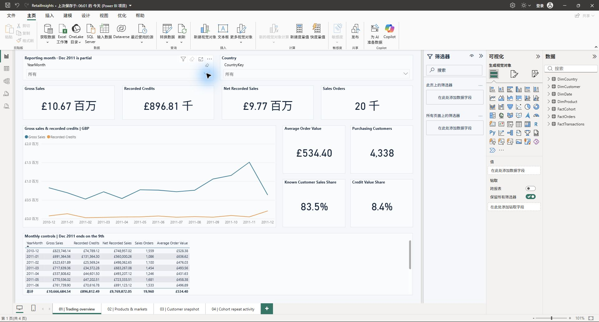

# Online Retail Analysis｜網上零售數據分析

A data analysis project using Python, SQL and Power BI to explore sales, customer
segments and repeat purchases in the UCI Online Retail dataset. The data covers
December 2010 to December 2011 and contains 541,909 rows.

使用 Python、SQL 及 Power BI 分析 UCI Online Retail 公開數據，探索銷售、客戶分群及回購情況。
數據涵蓋 2010 年 12 月至 2011 年 12 月，共有 541,909 筆記錄。



## Report pages｜報表頁面

| Page／頁面 | What it covers／分析內容 |
| --- | --- |
| Overview／概覽 | Monthly and country sales, credits and order value／按月份及國家查看銷售、貸記金額與訂單金額 |
| Products／商品 | Product sales and merchandise versus other charges／商品銷售，以及商品與其他收費的區分 |
| Customers／客戶 | Recency, frequency and monetary value (RFM) groups／以最近購買時間、購買頻率及購買金額分群 |
| Cohorts／購買群組 | Monthly purchase activity by first observed purchase month／按首次觀察到的購買月份比較每月購買活動 |

Customer groups use a fixed snapshot at the end of the dataset. They do not
change with the sales page's date filter.

客戶分群採用數據期末的固定快照，不會隨銷售頁的日期篩選改變。

## A few results｜主要結果

| Metric／指標 | Result／結果 |
| --- | ---: |
| Gross sales／銷售總額 | £10,666,684.54 |
| Recorded credits／已記錄貸記金額 | £896,812.49 |
| Net recorded sales／已記錄銷售淨額 | £9,769,872.05 |
| Sales orders／銷售訂單 | 19,960 |
| Identifiable purchasing customers／可識別的購買客戶 | 4,338 |
| Customers with more than one order／曾下多筆訂單的客戶比例 | 65.6% |

The UK accounts for 84.6% of gross sales. The Champions RFM group has 911
customers and accounts for about 63.8% of sales linked to known customers.
More detail is in [results](docs/results.md).

英國佔銷售總額的 84.6%。RFM 的 Champions 群組有 911 名客戶，佔可識別客戶銷售額約 63.8%。
詳見[分析結果](docs/results.md)。

## Run it｜執行方式

The scripts need Python 3.10+; the report needs Power BI Desktop.

腳本需要 Python 3.10 或以上版本；報表使用 Power BI Desktop 開啟。

```bash
python -m pip install -r requirements.txt
python scripts/download_data.py
python scripts/prepare_data.py
python scripts/check_data.py
python scripts/setup_paths.py
```

Open `powerbi/OnlineRetail.pbip`, apply pending query changes if prompted, then
refresh. Prepared CSVs are included, so downloading and preparing the data can
be skipped when just opening the report. See the [setup notes](docs/setup.md).

開啟 `powerbi/OnlineRetail.pbip`，按提示套用變更後重新整理。倉庫已包含整理好的 CSV，
只查看報表可略過下載及資料整理步驟。詳見[開啟指南](docs/setup.md)。

The local working folder also has `powerbi/OnlineRetail.pbix` with data loaded.
It is not committed because its refresh settings contain a local file path.
Before committing, run `python scripts/setup_paths.py --portable` to restore
the source project's placeholder path.

本機另有已載入數據的 `powerbi/OnlineRetail.pbix`；因重新整理設定包含本機路徑，未上傳至 GitHub。
提交修改前，請執行 `python scripts/setup_paths.py --portable`，將源碼路徑還原為佔位值。

## Files｜檔案結構

| Folder／資料夾 | Contents／內容 |
| --- | --- |
| `scripts/` | Download, clean, check and set paths／下載、整理、檢查及設定路徑 |
| `data/` | Source workbook (not committed) and prepared CSVs／原始工作簿（未上傳）及整理好的 CSV |
| `sql/` | Queries for checking and exploring data／核對及探索數據的查詢 |
| `powerbi/` | Report pages, Power Query and DAX model／報表頁面、Power Query 及 DAX 模型 |
| `tools/` | Rebuild and check report files／重建及檢查報表檔案 |
| `docs/` | Analysis notes, results and check records／分析筆記、結果及檢查記錄 |
| `assets/` | Report screenshots and theme／報表截圖及主題 |

To rebuild the source files, run `python tools/build_report.py` before setting
local paths. `python tools/check_report.py` checks the report JSON against
Microsoft's public schemas and needs internet access on its first run.
Desktop totals and two slicer examples were checked against SQL.
[Check records](docs/checks.json) describe the scope.

如需重建源碼，先執行 `python tools/build_report.py`，再設定本機路徑。
`python tools/check_report.py` 會按照 Microsoft 公開結構規範檢查報表 JSON，首次執行需要網絡連線。
已在 Desktop 核對總額及兩個篩選例子，並與 SQL 結果比較；詳見[檢查記錄](docs/checks.json)。

## Limitations｜限制

- Missing customer IDs remain in sales totals but are excluded from customer analysis.／缺少客戶 ID 的記錄保留在銷售總額中，但不納入客戶分析。
- Credits are separate and cannot all be matched to original purchases.／貸記金額單獨記錄，並非每筆都能對應原始購買。
- Exact repeated rows are kept because there is no unique transaction-line ID.／原始數據沒有唯一交易行 ID，因此保留完全重複的記錄。
- December 2011 ends on the 9th and is excluded from complete-month cohort comparisons.／2011 年 12 月只有截至 9 日的數據，不納入完整月份的群組比較。
- Wholesale orders mean average order value may not represent a typical shopper's basket.／數據包含批發訂單，平均訂單金額未必代表一般消費者的購物情況。

Cleaning rules and RFM definitions: [English](docs/notes.md) · [繁體中文](docs/notes.zh-Hant.md).
AI tools assisted with Python code and report-file generation; the check records
document verification of the result.

AI 工具協助編寫 Python 及產生報表檔案；檢查記錄列出結果的驗證範圍。

## Data source｜數據來源

Chen, D. (2015). *Online Retail*. UCI Machine Learning Repository.
[Dataset and DOI／數據及 DOI](https://doi.org/10.24432/C5BW33), CC BY 4.0.
See [data attribution／數據授權說明](DATA_LICENSE.md). Project code is MIT licensed／專案程式碼採用 MIT 授權。
