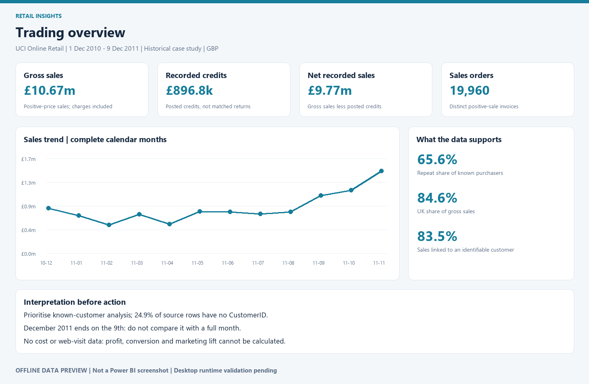
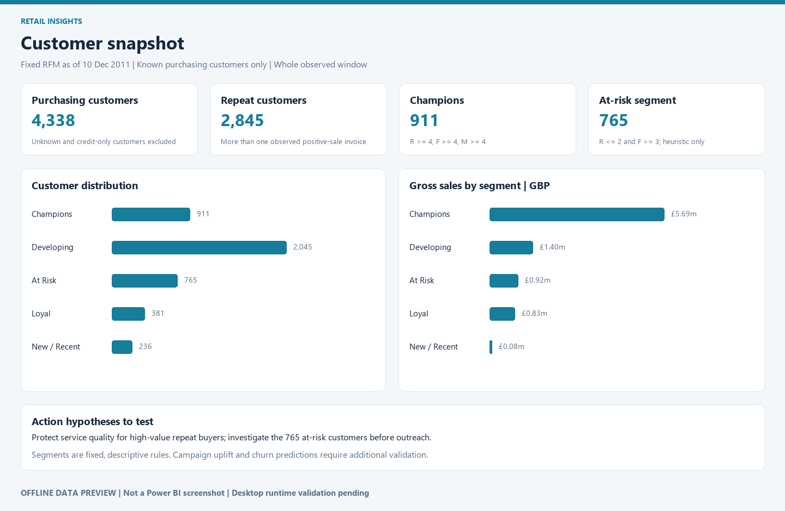
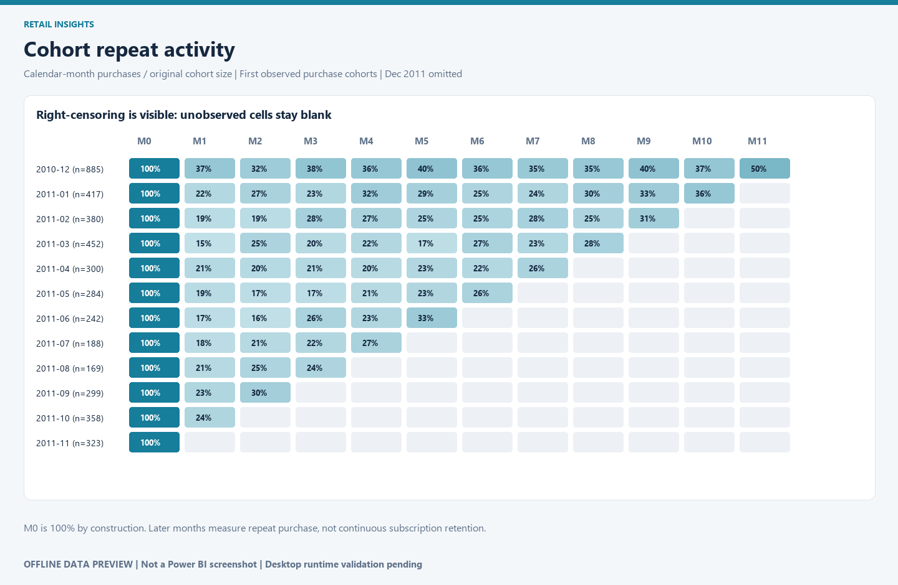

# Retail Insights — Power BI portfolio case study

A reproducible retail analysis covering trading performance, products and markets,
customer segmentation, and cohort repeat-purchase activity.

**Status:** Data preparation and SQL reconciliations passed. The native PBIP/PBIR
source report is generated and schema-validated. **Power BI Desktop refresh,
DAX execution and visual interaction checks are pending.** The images below are
data-derived offline previews, not Power BI screenshots. This is an independent
historical case study; no affiliation with the retailer or UCI is implied.



## Business questions

1. How do recorded sales, credits and order values vary over time?
2. Which products and countries contribute to gross sales?
3. Which identifiable customers repeatedly purchase and merit further investigation?
4. How does repeat-purchase activity differ across first-observed-purchase cohorts?

## Results at a glance

| Metric | Observed result |
| --- | ---: |
| Original source rows | 541,909 |
| Gross positive sales | £10,666,684.54 |
| Recorded credits | £896,812.49 |
| Net recorded sales | £9,769,872.05 |
| Positive-sale invoices | 19,960 |
| Identifiable purchasing customers | 4,338 |
| Whole-window repeat customer share | 65.6% |
| Gross sales linked to identifiable customers | 83.5% |

These figures use the policy in [methodology](docs/methodology.md). They are not
profit, a matched return rate, or current-market estimates.

## Power BI deliverable

Open **`powerbi/RetailInsights.pbip`** in standard Power BI Desktop. The report
contains four pages, 25 native visuals, seven tables and 18 DAX measures.

| Page | Purpose |
| --- | --- |
| Trading overview | Month/country slicers, financial KPIs, monthly trends and controls |
| Products & markets | Product/country comparisons, merchandise/charges selection, detail |
| Customer snapshot | Fixed RFM segments, customer counts, sales contributions, customer detail |
| Cohort repeat activity | Cohort slicer, month-offset matrix, explicit observed-cell denominators |

The model uses invoice-line and invoice-level facts with shared single-direction
dimensions. The cohort aggregate is separate so its denominators cannot be
silently changed by unrelated slicers. Monetary values use fixed-decimal types.

### Open with the included prepared data

```bash
python scripts/configure_local.py
```

Then open the PBIP and select **Refresh**. `DataFolder` must point to the clone's
`data/processed` folder. The project has no Desktop cache; visuals will populate
only after refresh. Optionally apply `assets/retail-theme.json` through
View → Themes → Browse for themes.

Do not commit the personal local path inserted by `configure_local.py`. Regenerate
the report with `python scripts/build_powerbi.py` to restore the portable placeholder.
See [Chinese opening and validation guide](docs/打开项目.md).

### Reproduce from the original source

Requires Python 3.10+ and the dependencies in `requirements.txt`.

```bash
python -m venv .venv
# Windows: .venv\Scripts\activate
# macOS/Linux: source .venv/bin/activate
python -m pip install -r requirements.txt
python scripts/download_data.py
python scripts/analyze.py
python scripts/build_powerbi.py
python scripts/validate_report.py
python scripts/create_previews.py
python scripts/configure_local.py
```

The validator retrieves public Microsoft schemas and requires network access.
The download script retrieves the original workbook from UCI. Prepared CSVs are
included for opening the report without rerunning preparation; raw data, SQLite
working databases, package folders and Desktop caches are ignored by Git.

## Analytical decisions

- Retain sales without customer IDs in financial totals, but exclude them from
  identifiable-customer RFM and cohort denominators.
- Preserve credit-only customer IDs for referential integrity without counting them as purchasers.
- Keep exact repeated source rows: missing transaction-line identifiers prevent confident deduplication.
- Separate positive-price purchases, negative-quantity credits and excluded entries.
- Omit incomplete December 2011 cohort cells. Blank means unobserved; observed zero stays zero.
- Use tied percentile ranks and documented RFM rules rather than claiming a trained churn model.
- Label customer scores as a fixed snapshot as of 10 December 2011.




## Inspect the work

- [Analysis and action hypotheses](docs/findings.md)
- [Data contract and limitations](docs/methodology.md)
- [DAX measures](docs/measures.dax)
- [SQL analysis and controls](sql/analysis.sql)
- [Machine-readable analysis summary](docs/analysis_summary.json)
- [Validation status](docs/validation.json)
- [Interview and learning notes (中文)](docs/学习与面试.md)

## Data attribution and license

Chen, D. (2015). *Online Retail* [Dataset]. UCI Machine Learning Repository.
[DOI 10.24432/C5BW33](https://doi.org/10.24432/C5BW33), licensed under CC BY 4.0.
The original observations span 1 December 2010–9 December 2011.
See [data attribution](DATA_LICENSE.md). Project code and authored report definitions
are MIT-licensed; source and derived data retain their attribution requirements.

## Technical references

- [Microsoft: Power BI Desktop projects](https://learn.microsoft.com/en-us/power-bi/developer/projects/projects-overview)
- [Microsoft: PBIR report format](https://learn.microsoft.com/en-us/power-bi/developer/projects/projects-report)
- [Microsoft: semantic model format](https://learn.microsoft.com/en-us/power-bi/developer/projects/projects-dataset)
