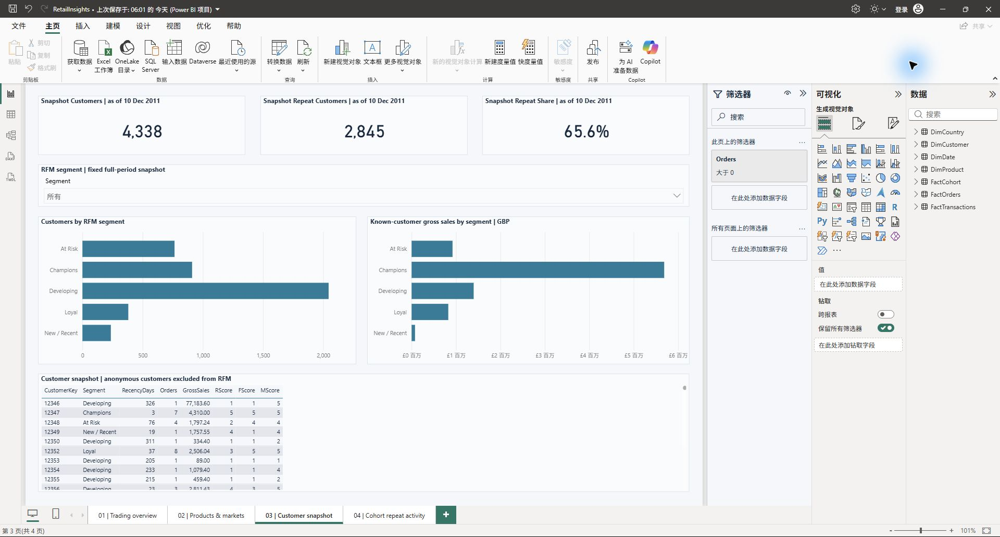
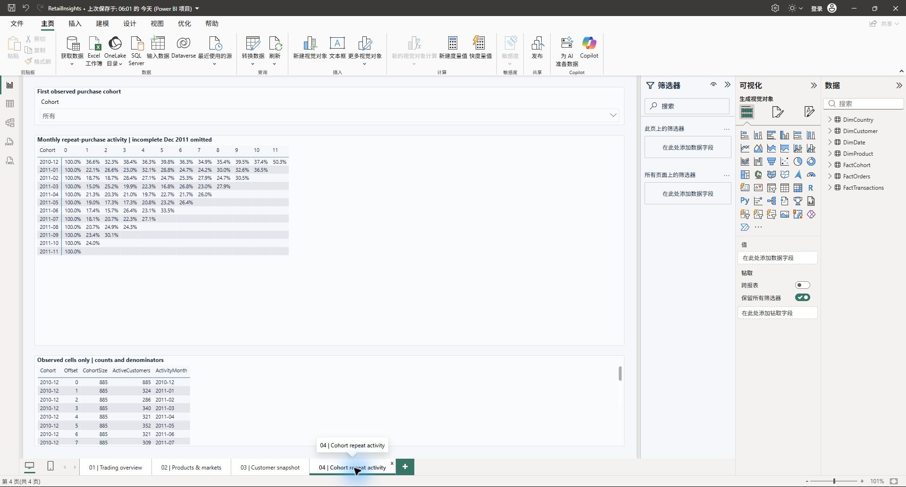

# Results｜分析結果

## Sales and markets｜銷售與市場

Gross sales are £10.67m, recorded credits £896.81k and net recorded sales £9.77m.
These are transaction amounts, not profit: the dataset has no cost data.
The UK contributes 84.6% of gross sales. Monthly trends within each country
give a more useful comparison than country totals alone.

銷售總額為 £10.67m，已記錄貸記金額為 £896.81k，銷售淨額為 £9.77m。
這些是交易金額；數據沒有成本資料，無法計算利潤。英國佔銷售總額的 84.6%，
因此除了比較國家總額，亦需觀察各國的每月趨勢。

## Repeat purchases｜回購情況

2,845 of 4,338 known purchasing customers placed more than one order (65.6%).
This uses the whole observation window. Customers first seen near the end have
less time to place another order, so the report also compares cohorts.
First observed purchase is not necessarily a customer's first-ever purchase.

4,338 名可識別的購買客戶中，有 2,845 名曾下多筆訂單（65.6%）。這個比例使用整段觀察期。
較晚出現的客戶有較少時間再次購買，因此報表亦按購買群組比較。
首次觀察到的購買，不一定是客戶歷來第一次購買。

## RFM groups｜RFM 客戶分群

Champions has 911 customers and £5.69m in gross sales, about 63.8% of known-customer
sales. Sales are concentrated among high-value repeat buyers. At Risk has 765
customers; the label comes from RFM rules and does not prove actual churn.

Champions 群組有 911 名客戶，銷售總額為 £5.69m，約佔可識別客戶銷售額的 63.8%，
反映銷售集中於高價值的回購客戶。At Risk 群組有 765 名客戶；這是根據 RFM 規則作出的分類，
不能證明客戶已經流失。

## Data gaps｜數據缺口

135,080 source rows have no customer ID (24.9%). They count towards sales but
cannot identify repeat customers. December 2011 has only nine days of data;
its lower sales should not be interpreted as a sudden decline.

原始數據有 135,080 筆記錄缺少客戶 ID（24.9%）。它們計入銷售，但無法用於識別回購客戶。
2011 年 12 月只有九天數據，不能將其較低銷售額解讀為突然下跌。

## Possible next steps｜後續方向

With more data, useful steps would be to investigate missing IDs, match credits
to invoices and compare buying intervals across customer groups. Campaign and
cost data would be needed to evaluate marketing actions or profit.

如有更多資料，可研究缺失 ID 的原因、將貸記記錄對應原始發票，並比較各客戶群組的購買間隔。
評估營銷成效或利潤，則需要活動與成本資料。

